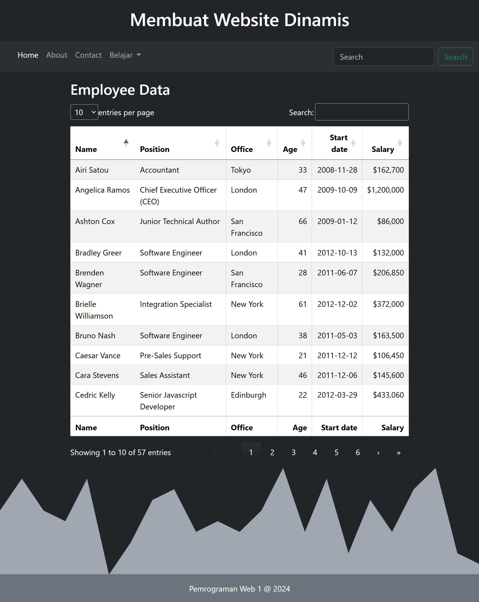
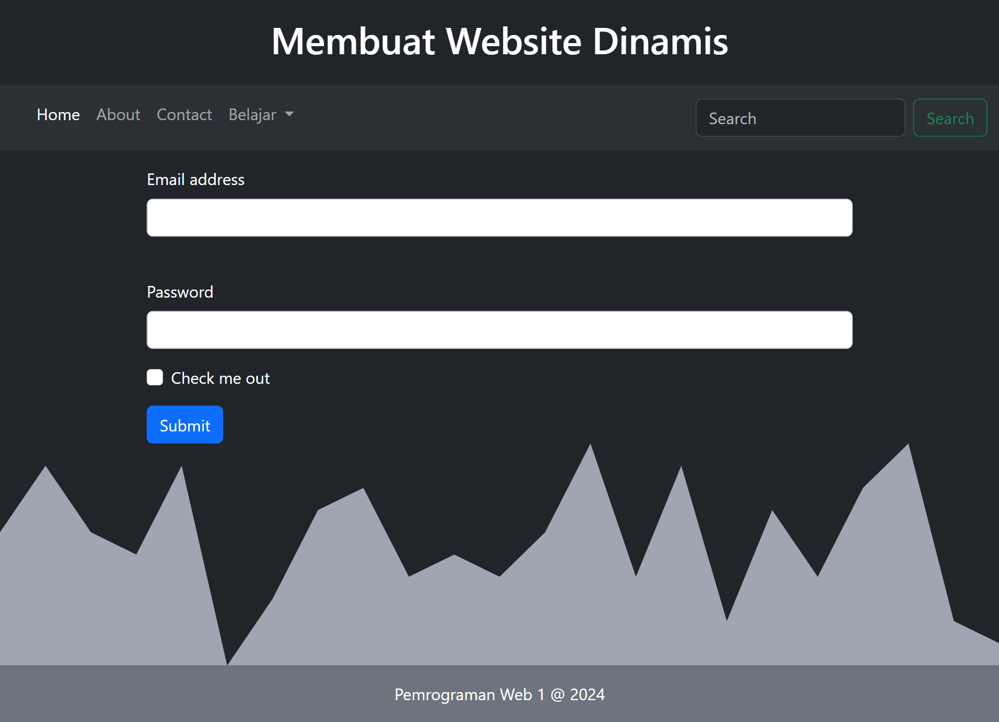

# WebDinamis
## UTS Pemrograman Web 1

 

| Variable           |             Isi            |
| -------------------|----------------------------|
| **Nama**           |         Fadil Aditya Adzima    |
| **NIM**            |          312310617         |
| **Kelas**          |          TI.23.A.6         |
| **Mata Kuliah**    |      Pemrograman Web 1     |
| **Dosen Pengampu** | Eko Budiarto s.kom, m.kom  |

     

# $${\color{lightblue}Home-Page}$$
 

    

Bagian atas memiliki menu navigasi untuk mengakses berbagai halaman seperti Home, About, Contact, dan Belajar. Terdapat juga fitur pencarian untuk mencari konten spesifik di dalam situs.  

Bagian utama menampilkan foto Fadil, namanya, dan posisinya. Di bawah nama terdapat ikon media sosial dan kontak, termasuk GitHub, Instagram, email, dan LinkedIn, untuk menghubungi Fadil secara langsung.  

Bagian bawah memiliki grafik poligon dengan latar warna gelap, memberi kesan dinamis dan estetis. Pada footer, terdapat tulisan "Pemrograman Web 1 @ 2024," yang mungkin menunjukkan bahwa situs ini adalah proyek untuk mata kuliah Pemrograman Web.  

     

# $${\color{lightblue}About-Page}$$
 

    

Di bagian ini, terdapat beberapa kartu yang menggambarkan minat, keahlian, dan hobi pemilik  

Secara keseluruhan, website ini menampilkan profil pemilik yang memiliki minat dan hobi di bidang teknologi, olahraga, musik, dan kopi, memberikan gambaran lebih dekat tentang kepribadiannya.      

# $${\color{lightblue}Contact-Page}$$
 

    

Dengan bagian contact page yang memungkinkan pengunjung untuk terhubung dengan pemilik. Pada halaman "Contact Me," terdapat berbagai ikon media sosial dan platform komunikasi yang digunakan untuk menghubungi pemilik, yaitu :  

<b>GitHub</b> : Untuk menampilkan proyek dan kontribusi coding.  
<b>Instagram</b> : Untuk berbagi konten visual atau update pribadi.  
<b>Discord</b> : Untuk komunikasi berbasis komunitas atau obrolan langsung.  
<b>Email</b> : Untuk keperluan komunikasi profesional dan langsung.  LinkedIn</b> : Untuk koneksi profesional dan jaringan karier.  

Desain halaman ini sederhana namun efektif, dengan ikon-ikon kontak yang jelas terlihat di tengah layar. Bagian bawah halaman memiliki grafik poligon, memberi kesan estetis yang konsisten dengan tema situs. Footer menyertakan tulisan "Pemrograman Web 1 @ 2024" yang menunjukkan bahwa situs ini mungkin adalah proyek dari mata kuliah Pemrograman Web.

     

# $${\color{lightblue}Database-Page}$$
 

     

# $${\color{lightblue}Form-Page}$$
 

     

# $${\color{lightblue}Error-Page}$$
 

